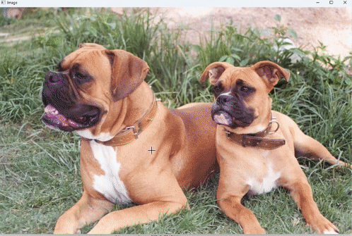
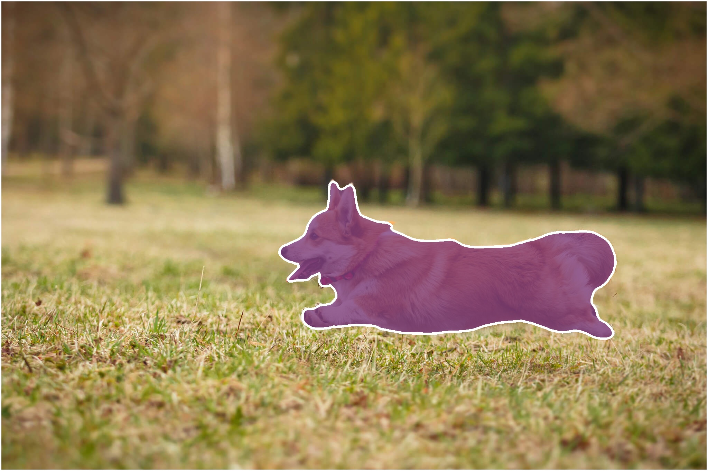
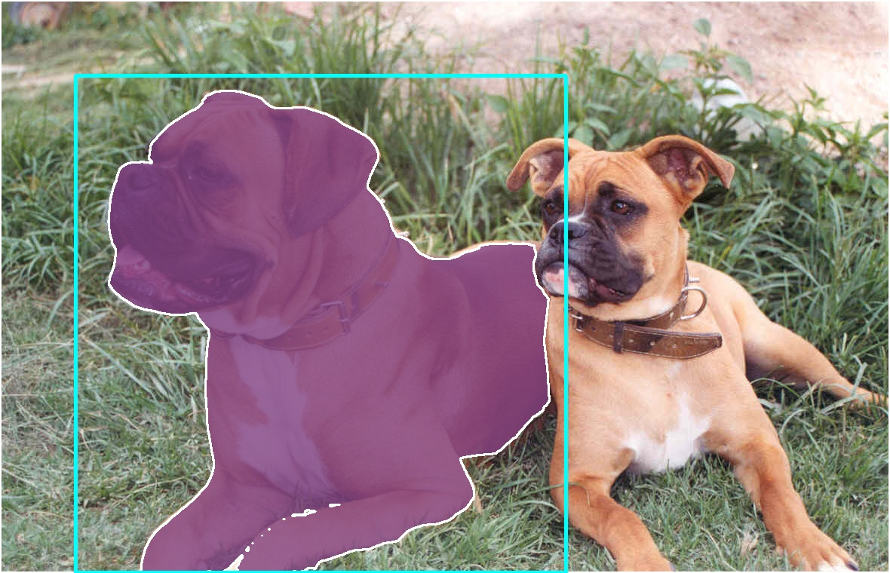

<h1 align="center"><span>NanoSAM C++</span></h1>

This repo provides a C++ implementation of Nvidia's [NanoSAM](https://github.com/NVIDIA-AI-IOT/nanosam), a distilled segment-anything model, for real-time inference on GPU.

<p align="center" margin: 0 auto;>
  
   
</p>

## ⚙️ Usage
1. There are two ways to load engines:

     1. Load engines built by trtexec:

        ```cpp
        #include "nanosam/nanosam.h"

        NanoSam nanosam(
            "resnet18_image_encoder.engine",
            "mobile_sam_mask_decoder.engine"
        );
        ```
     2. Build engines directly from onnx files:
      
        ```cpp
        NanoSam nanosam(
            "resnet18_image_encoder.onnx",
            "mobile_sam_mask_decoder.onnx"
        );
        ```

2. Segment an object using a prompt point:

   ```cpp
   Mat image = imread("assets/dog.jpg");
   // Foreground point
   vector<Point> points = { Point(1300, 900) };
   vector<float> labels = { 1 }; 

   Mat mask = nanosam.predict(image, points, labels);
   ```

   <table style="margin-right:auto; text-align:center;">
      <tr>
        <td style="text-align: center;">Input</td>
        <td style="text-align: center;">Output</td>
      </tr>
      <tr>
        <td></td>
        <td></td>
      </tr>
   </table>

3. Create masks from bounding boxes:

   ```cpp
   Mat image = imread("assets/dogs.jpg");
   // Bounding box top-left and bottom-right points
   vector<Point> points = { Point(100, 100), Point(750, 759) };
   vector<float> labels = { 2, 3 }; 

   Mat mask = nanosam.predict(image, points, labels);
   ```

   <table style="margin-right:auto; text-align:center;">
     <tr>
       <td style="text-align: center;">Input</td>
       <td style="text-align: center;">Output</td>
     </tr>
     <tr>
       <td></td>
       <td></td>
     </tr>
  </table>

<details>
<summary>Notes</summary>
The point labels may be

| Point Label | Description |
|:--------------------:|-------------|
| 0 | Background point |
| 1 | Foreground point |
| 2 | Bounding box top-left |
| 3 | Bounding box bottom-right |
</details>


## Performance
The inference time includes the pre-preprocessing time and the post-processing time:
| Device          | Image Shape(WxH)	 | Model Shape(WxH)	 | Inference Time(ms) |
|----------------|------------|------------|------------|
| RTX4090        |2048x1365  |1024x1024       |14       |

## 🛠️ Installation

1. Download the image encoder: [resnet18_image_encoder.onnx](https://drive.google.com/file/d/14-SsvoaTl-esC3JOzomHDnI9OGgdO2OR/view?usp=drive_link)
2. Download the mask decoder: [mobile_sam_mask_decoder.onnx](https://drive.google.com/file/d/1jYNvnseTL49SNRx9PDcbkZ9DwsY8up7n/view?usp=drive_link)    
3. Download the [TensorRT](https://developer.nvidia.com/tensorrt) zip file that matches the Windows version you are using.
4. Choose where you want to install TensorRT. The zip file will install everything into a subdirectory called `TensorRT-8.x.x.x`. This new subdirectory will be referred to as `<installpath>` in the steps below.
5. Unzip the `TensorRT-8.x.x.x.Windows10.x86_64.cuda-x.x.zip` file to the location that you chose. Where:
- `8.x.x.x` is your TensorRT version
- `cuda-x.x` is CUDA version `11.8` or `12.0`
6. Add the TensorRT library files to your system `PATH`. To do so, copy the DLL files from `<installpath>/lib` to your CUDA installation directory, for example, `C:\Program Files\NVIDIA GPU Computing Toolkit\CUDA\vX.Y\bin`, where `vX.Y` is your CUDA version. The CUDA installer should have already added the CUDA path to your system PATH.
7. Ensure that the following is present in your Visual Studio Solution project properties:
- `<installpath>/lib` has been added to your PATH variable and is present under **VC++ Directories > Executable Directories**.
- `<installpath>/include` is present under **C/C++ > General > Additional Directories**.
- nvinfer.lib and any other LIB files that your project requires are present under **Linker > Input > Additional Dependencies**.
8. Download and install any recent [OpenCV](https://opencv.org/releases/) for Windows.
  
## Acknowledgement
Some of functions were borrowed from the following projects.
- [NanoSAM](https://github.com/NVIDIA-AI-IOT/nanosam) - The distilled Segment Anything (SAM).
- [TensorRTx](https://github.com/wang-xinyu/tensorrtx) - Implementation of popular deep learning networks with TensorRT network definition API.
- [TensorRT](https://github.com/NVIDIA/TensorRT/tree/release/8.6/samples) - TensorRT samples.
